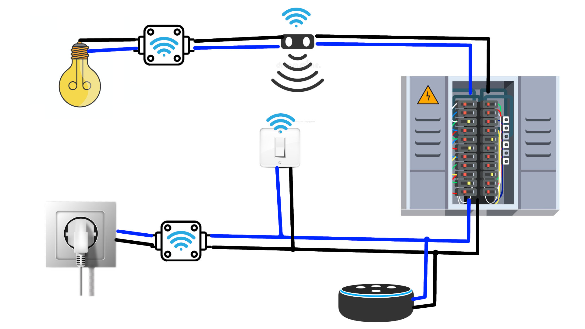
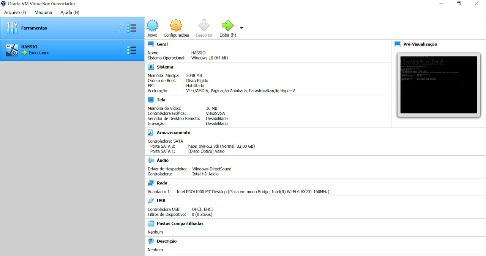
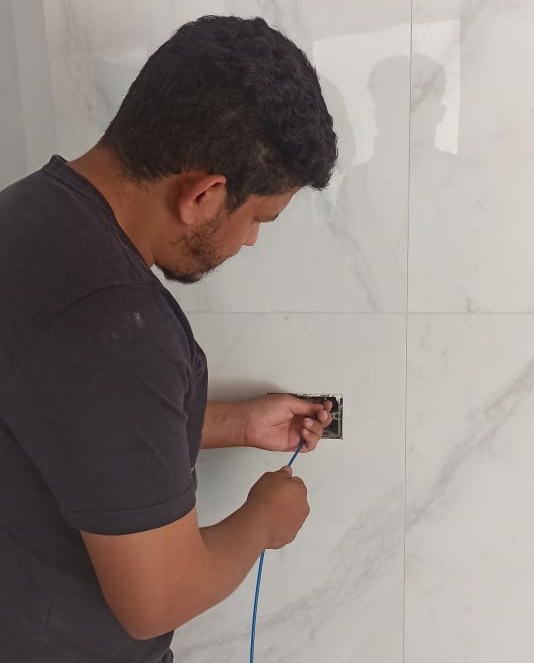

## Assignment

- Plan and sketch a potential final project.

## Home Automation using Alexa 

In this first week we are supposed to start to think about our final project and produce some sketches of it.

My idea is to create an automated room at my apartment and use an Alexa from Amazon to control all the commands.
Also I want to create my own scripts to automate some functions like creating lighting modes like theater mode, ability to control my lights and electronics from my phone or an app when I'm outside my house.

### Phisical Implementation

The steps needed to make this possible are as follows:

- Create the electrical layout of the new room so to correctly dimension the wiring needed as well as defining where to place new outlets.

- Change the circuit breakers to accommodate all the electronics

- Choose witch electrical automation's controllers are possible to be DIYed and witch ones are better buy 

- Create new automation loops and functions to use in the room.

### Digital Implementation

- Install [Hass.io](https://www.home-assistant.io/installation/) to a RaspberryPi(for testing I'm going to use a virtual machine, like [Virtual Box](https://www.virtualbox.org/))

- Install [HomeAssist Container](https://www.home-assistant.io/installation/raspberrypi#install-home-assistant-container) and [Node-Red](https://nodered.org/)

## Wiring

