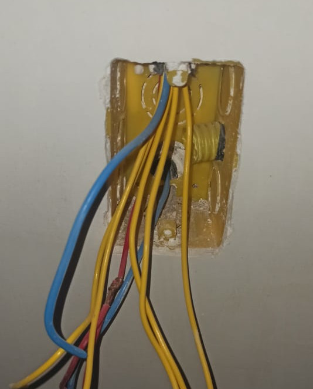
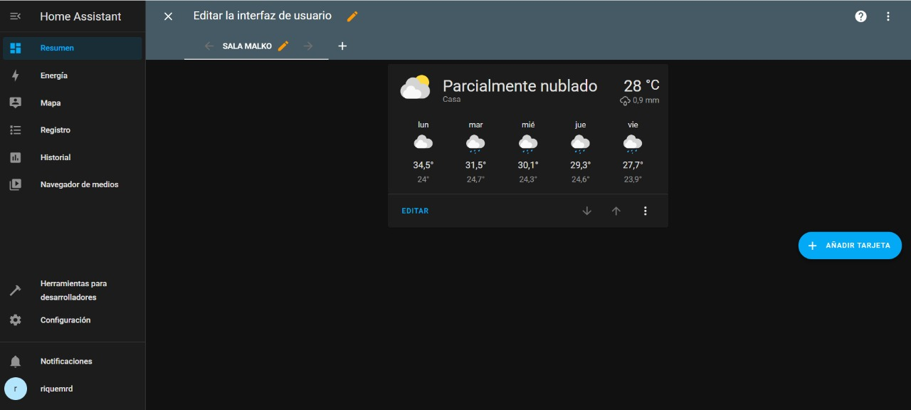
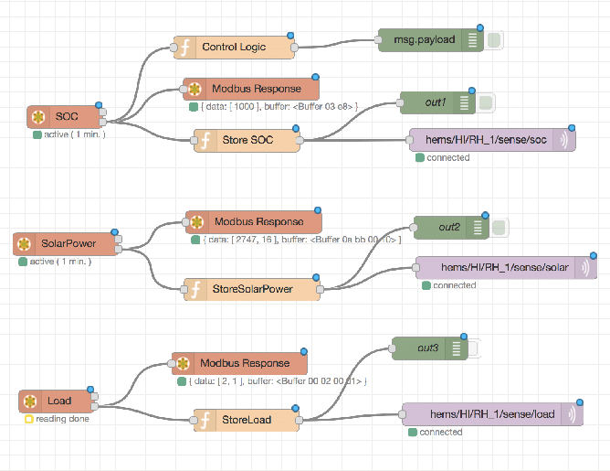

## Assignment

- Plan and sketch a potential final project.

## Home Automation using Alexa 

In this first week we are supposed to start to think about our final project and produce some sketches of it.

My idea is to create an automated room at my apartment and use an Alexa from Amazon to control all the commands.
Also I want to create my own scripts to automate some functions like creating lighting modes like theater mode, ability to control my lights and electronics from my phone or an app when I'm outside my house.

### Physical Implementation

The steps needed to make this possible are as follows:

- Create the electrical layout of the new room so to correctly dimension the wiring needed as well as defining where to place new outlets.

- Change the circuit breakers to accommodate all the electronics

- Choose witch electrical automation's controllers are possible to be DIYed and witch ones are better buy 

- Create new automation loops and functions to use in the room.

### Digital Implementation

- Install [Hass.io](https://www.home-assistant.io/installation/) to a Raspberry Pi(for testing I'm going to use a virtual machine, like [Virtual Box](https://www.virtualbox.org/))

- Install [Home Assist Container](https://www.home-assistant.io/installation/raspberrypi#install-home-assistant-container) and [Node-Red](https://nodered.org/)

## Wiring

This is the room that I'll be doing the automation's

<video controls width="385">

    <source src="files/1/room.mp4">

</video>

 Back to top

{:.left}
{:.right}

## Installation of the Home Assist System

To make the installation I followed the instructions of the video bellow:

<iframe width="1904" height="779" src="https://www.youtube.com/embed/BgD1rHd65sg" title="YouTube video player" frameborder="0" allow="accelerometer; autoplay; clipboard-write; encrypted-media; gyroscope; picture-in-picture" allowfullscreen></iframe>

This is the configuration I used in my Virtual Box to install all Home Assist systems

## Home Assist Dashboard

This is the main screen of the Home Assist and it functions as a visual dashboard and from there I'm able to do some basic controls using some pre-programmed functions

## Node Red

{: .center}

Using Node Red I'm able to create custom interconnections between different sensors and applications, like, if a sensor sees it is dark inside and the motion sensor detects movement in the house it can keep the lights on in the room. You can also listen for Wi-fi connections in a specific room and act accordingly.

Bellow there is an example of how is the workflow.

{: .center}
