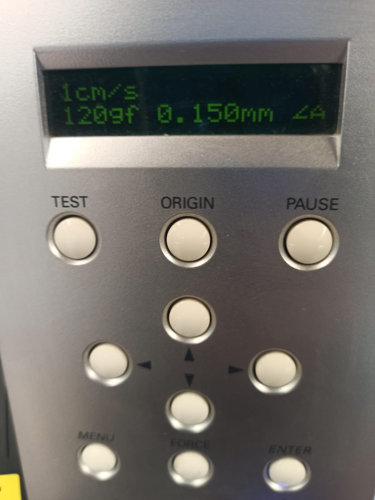

# 4. Computer Controlled Cutting

## Assignment

* Group assignment:

    * characterize your lasercutter's focus, power, speed, rate, kerf, and joint clearance;
    * document your work (individually or in group).

*   Individual assignments

    * Design, lasercut, and document a parametric press-fit construction kit, which can be assembled in multiple ways. Account for the lasercutter kerf;
    * cut something on the vinylcutter.

## Group assignment
**All of the test files were created using Autodesk Fusion 360 by the lab technician Leonardo Nazário. And then, we made the conversion for `.dxf` files.**

### Material
For the tests, the MDF (Medium-density fibreboard) with a thickness of 3 mm was used.

{.center style="height:250px"}

### Sofware
The laser cutter model is [Duplotech 1080](https://www.insper.edu.br/fab-lab/equipamentos/) and its software is called [RDWorks (RDCAM)](http://www.duploj.com.br/suporte). It can support `.dxf` and .`bitmap` files. Here is its interface.

{.center style="height:400px"}

### Focus
The laser cutter has a manual focus. According to the manufacturer's instructions, the distance between the material surface and the laser nozzle must be 6 mm. Therefore, we placed a 6 mm thick piece of acrylic on the MDF sheet and let the laser nozzle touches it (the two screws highlighted in the picture below can be handled to allow the cannon to be free/fixed).

{.center style="height:300px"}

### Setting test (power, speed, rate)
To get a better sense of what the best parameters are for cutting and engraving we developed two tests, one of power(%) vs speed(mm/s) for testing cutting parameters and another one with interval(mm) vs power(%) using a fixed speed of 350mm/s to test engraving parameters. We set different parameters up divided by colors.

You can download the setting test file [here](4downloads/Setting_test.dxf).

{.center style="height:400px"}

{.center}

{.center}

|The results after cutting and engraving in 3mm MDF|
|:------------------------------------------------:|
|       {.center}      |

### Kerf Test
In this file were drawn some 15 mm diameter circles. Each color was set up with a different power (%). And the first row was cut with a speed of 5 mm/s and the second 15 mm/s.

You can download the kerf test file [here](4downloads/Kerf_test.dxf).

{.center style="height:400px"}

{.center style="height:400px"}

There isn’t that much of a difference changing the parameters. The calculated kerf is around ***0.225mm*** and ***0.275mm***.
{.center}

### Joint clearance test
Setting value: power 70%, speed 15mm/s.
You can download the joint clearance test file [here](4downloads/Join test.dxf).

{.center style="height:400px"}

{.center style="height:400px"}

{.center style="height:400px"}

{.center style="height:400px"}

The gap which had the best fit was 2.75mm (kerf around 0,25mm).

{.center style="height:400px"}

## Individual assignment

### Parametric press-fit construction kit

### Laser cutting machine parameters

### Vinyl Cutter
To test the vinyl cutter, I used the vector file of [Midoryia](https://rmeliana.github.io/FabAcademy/3Computer%20Aided%20Design/3Computer%20Aided%20Design/#inkscape) which was made at the CAD assignment with Inkscape. I decided to use heat transfer vinyl to stamp my lab coat (one more print :joy:).

{.center style="height:400px"}

The heat vinyl has a plastic protection that makes easier to transfer the print for clothing. When the sticker is printed, the plastic film has to be facing upwards. Therefore, the cut must be made by the side without protection.

{.center style="height:300px"}

Using the Inkscape, I let just the vectorized image in the screen and after mirrored it.

{.center style="height:380px"}

I just wanted to cut the character without the rectangle around it. For that, I selected the vectorized image and after actived the command "Separar". Seeing the pictures below, we can see that vectors are separated and I deleted the rectangle.

{.center style="height:340px"}

{.center style="height:380px"}

{.center style="height:450px"}

I resized the picture for a height of 100 mm.

#### Cutting the heat vinyl
The vinyl cutter that we have at the lab is the Roland GX-24 (CAMM-1 SERVO). I placed the piece of material in the machine, set the parameters up and started the cut.

{.center style="height:340px"}

{.center style="height:380px"}

It's time to take off the pieces I don't need. And start using the tweezer for the little ones.

{style="height:340px"} &nbsp;
{style="height:340px"}

At that point, I realized that these little pieces didn't cut right (I failed! :disappointed: ). So, I changed the force to 130gf and cut it again. Now it worked!!!

{style="height:340px"} &nbsp;
{style="height:340px"}

#### Priting the heat vinyl

I positioned my lab coat into the thermal press machine. I closed it and set the temperature to 180°C (it's important to let the clothing there be heated with the increasing temperature).

{style="height:440px"} &nbsp;
{style="height:440px"}

Then, when it reached 180°C, I placed the Midorya print, closed it again and set the time to 20 seconds.

{style="height:440px"} &nbsp;
{style="height:440px"}

I was so happy with the result!!!!

{style="height:440px"} &nbsp;
{style="height:440px"} &nbsp;
{style="height:440px"}

