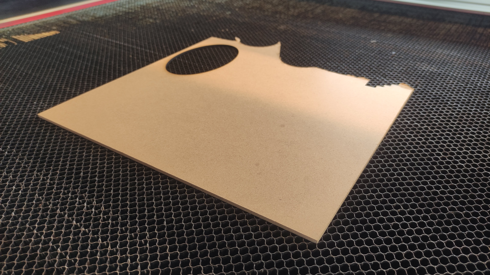
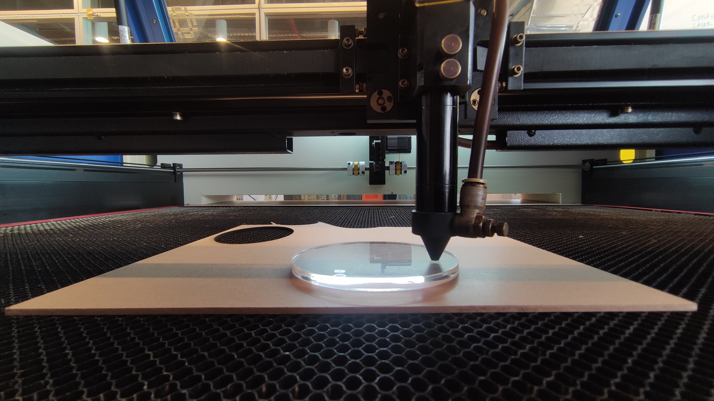
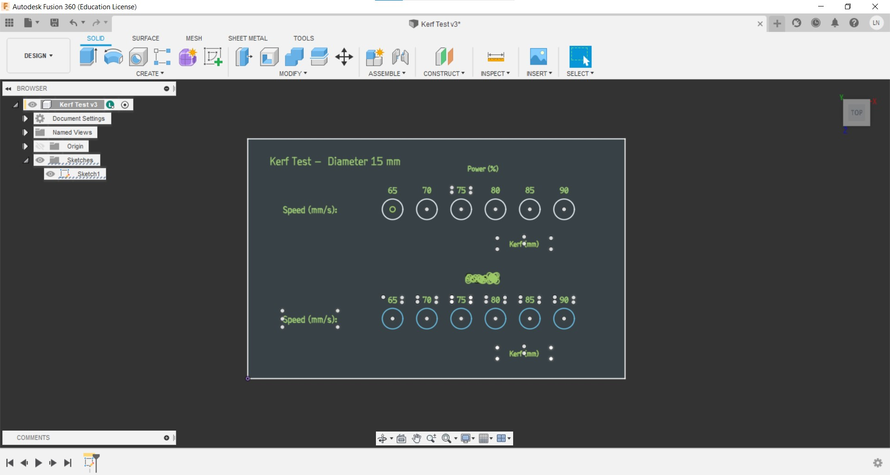
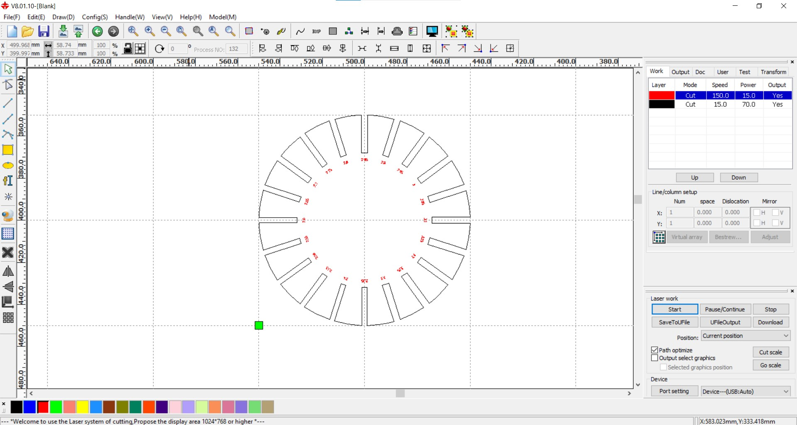
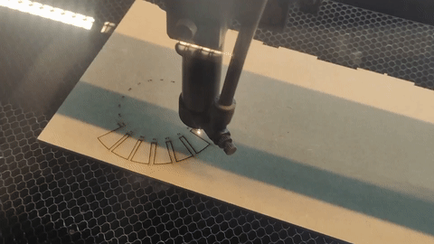
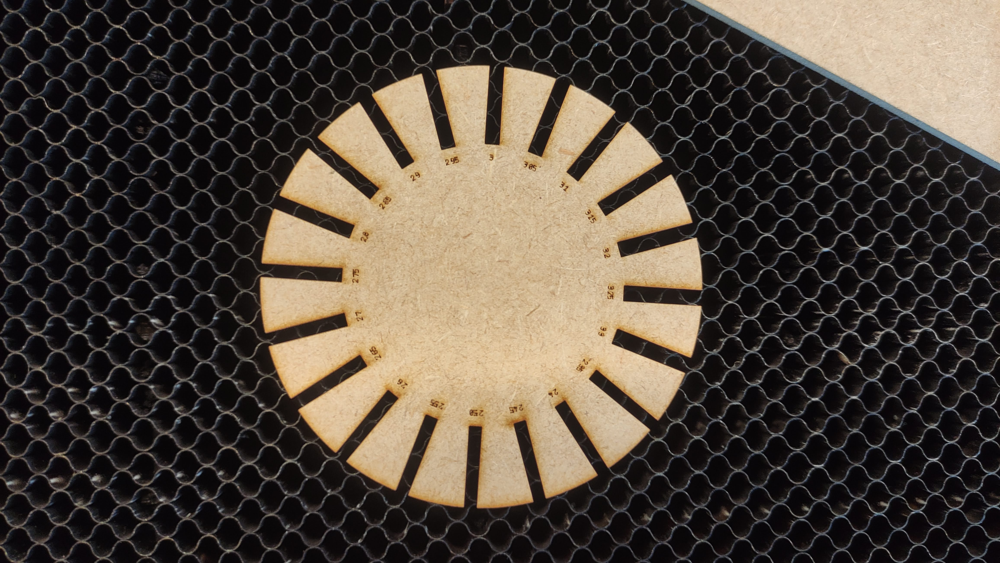

## Group Assignment

characterize your lasercutter's focus, power, speed, rate, kerf, joint clearance and types

**All of the test files were created using Autodesk Fusion 360 by the lab technician Leonardo Nazário and then exported as `.dxf` files.**

### Material
For the tests, the MDF (Medium-density fibreboard) with a thickness of 3 mm was used.

{.center style="height:250px"}

### Sofware
The laser cutter model is [Duplotech 1080](https://www.insper.edu.br/fab-lab/equipamentos/) and its software is called [RDWorks (RDCAM)](http://www.duploj.com.br/suporte). It can support `.dxf` and .`bitmap` files. Here is its interface.

{.center style="height:400px"}

### Focus
The laser cutter has a manual focus. According to the manufacturer's instructions, the distance between the material surface and the laser nozzle must be 6 mm. Therefore, we placed a 6 mm thick piece of acrylic on top of the MDF sheet and let the laser nozzle touch it (the two screws highlighted in the picture below can be handled to allow the cannon to be free/fixed).

{.center style="height:300px"}

### Setting test (power, speed, rate)
To get a better sense of what the best parameters are for cutting and engraving we developed two tests, one of power(%) vs speed(mm/s) for testing cutting parameters and another one with interval(mm) vs power(%) using a fixed speed of 350mm/s to test engraving parameters. We set different parameters up divided by colors.

You can download the setting test file [here](files/4/Setting_test.dxf).

{.center style="height:400px"}

{.center}

{.center}

!!! tip "The results after cutting and engraving in 3mm MDF"
    {.center}

### Kerf Test
In this file were drawn some 15 mm diameter circles. Each color was set up with a different power (%). And the first row was cut with a speed of 5 mm/s and the second 15 mm/s.

You can download the kerf test file [here](files/4/Kerf_test.dxf).

{.center style="height:400px"}

{.center style="height:400px"}

There isn’t that much of a difference changing the parameters. The calculated kerf is around ***0.225mm*** and ***0.275mm***.
{.center}

### Joint clearance test
Setting value: power 70%, speed 15mm/s.
You can download the joint clearance test file [here](files/4/Join test.dxf).

{.center style="height:400px"}

{.center style="height:400px"}

{.center style="height:400px"}

{.center style="height:400px"}

The gap which had the best fit was 2.75mm (kerf around 0,25mm).

{.center style="height:400px"}

