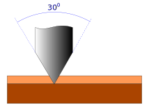

## Group Assignment

- Characterize the design rules for your PCB production process

## Design rules for PCB production

### Minimum trace width

 The minimum trace width we were able to produce using both the Rolland MDX-540 and Rolland MDX-40A was 0,6mm/23mils do to two factors:

 - Unevenness of phenolic based PCB's 
 - Difficulty of finding micro end-mills at the Brazilian market

As it's difficult to find micro end-mill to do the engraving part of the boards we end up using tapered mills instead, which causes some problems as the deeper you go into the material, the thicker the mill gets.

### Minimum isolation

 The minimum isolation hits on the same barrier as the trace width. If we use too little isolation the tapered end-mill starts milling away the other traces during isolation milling.

### Feeds & Speeds 

| Operation | Tool        | Cut Z(mm) | Multi-Depth(mm) | Travel Z(mm) | Feed Rate X-Y(mm/s) | Feed Rate Z(mm/s) | Spindle Speed(RPM) |
|:----------|:-----------:|----------:|----------------:|-------------:|--------------------:|------------------:|-------------------:|
| Drill     | 0.5mm-1.2mm |     -1.65 |            0.55 |           15 |                 450 |               650 |              12000 |
| Engrave   | 1/8" 30º    |     -0.11 |            0.06 |              |                 450 |               650 |              12000 |
| Profile   | 1/8"        |     -1.65 |            0.55 |           15 |                 300 |               400 |               8000 |

