## Group Assignment

- Test the design rules for your 3D printer(s)

- Document your work and explain what are the limits of your printer(s) (in a group or individually).

&nbsp;

### 3D Printing
&nbsp;

3D printing is a process of fabricating a three dimensional objects through a 3D digital model created in a Computer-Aided Design software (CAD). The process consists of the arrangement of successive layers to create the object and each layer can be seen as a thinly sliced cross-section of the object.

&nbsp;

### 3D Printer - Ultimaker 2+ 
&nbsp;

The Insper Fab Lab is equipped with two models of 3D printers, the **Ultimaker 2+** and a **Zmorph 2.0 SX**. For this group assignment we used the Ultimaker printer to test the design rules and document its limits.

Here are the equipment specifications:

- **Print technology:** Fused Deposition Modeling (FDM) 
- **Build volume :** 230 x 225 x 205mm
- **Filament diameter:** 2.85 mm
- **Nozzle diameter:** 0.4mm
- **Print speed:** 30 mm/s - 300 mm/s
- **Supported Filaments:** PLA and ABS.
- **Overall Size:** 357 x 342 x 388mm
- **File Transfer:** Standard SD card
- **Printing Software:** Cura

&nbsp;

### Preparing for printing in the Cura 
&nbsp;

To fulfill the requirements of this assignment, I used the [3D Printer Test Models](https://www.thingiverse.com/thing:533472/files) created by [Make Magazine](https://makezine.com/). It is possible to download the files [here](4Downloads/3D_printing_testers.zip).

The test models avaiables in those files are:

- Dimensional Accuracy
- Bridging Performance
- Overhang Performance
- Negative Space Tolerance
- Fine Positive Features Performance
- XY Resonance
- Z Resonance

I imported the files into [Cura](https://ultimaker.com/software/ultimaker-cura), a software developed by [Ultimaker](https://ultimaker.com/) where is possible to set up the printing configurations and parameters.

&nbsp;

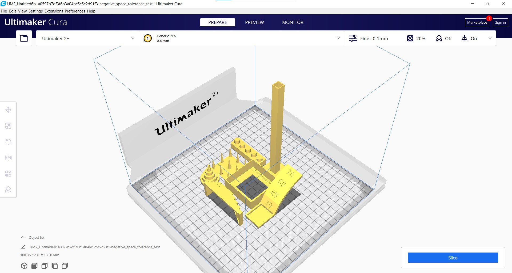{.center style="width:950px"}
&nbsp;

I set up the printing for PLA material and with the following parameters:

- **Layer Height:** 0.15mm
- **Wall Line Count:** 4
- **Top Layers:** 6
- **Bottom Layers:** 6
- **Infill Density:** 15%
- **Infill Pattern:** Grid
- **Print Speed:** 45mm/s
- **Build Plate Adhesion Type:** Raft

&nbsp;

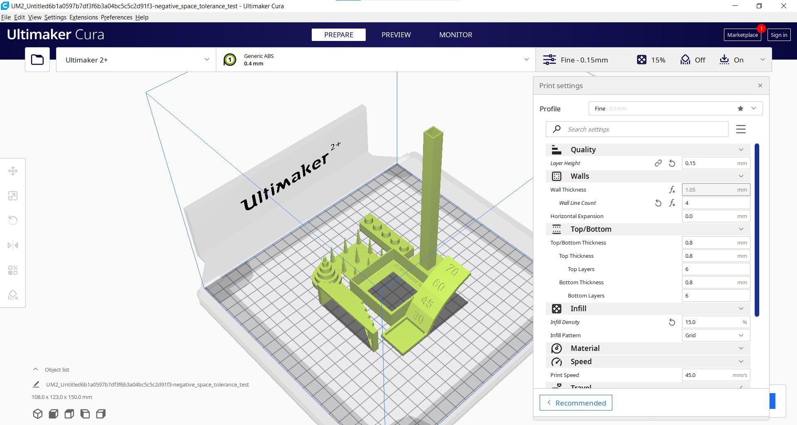{.center style="width:950px"}

&nbsp;

Here is a preview from Cura of the printing showing that it going to take almost 10 hours of printing.

&nbsp;

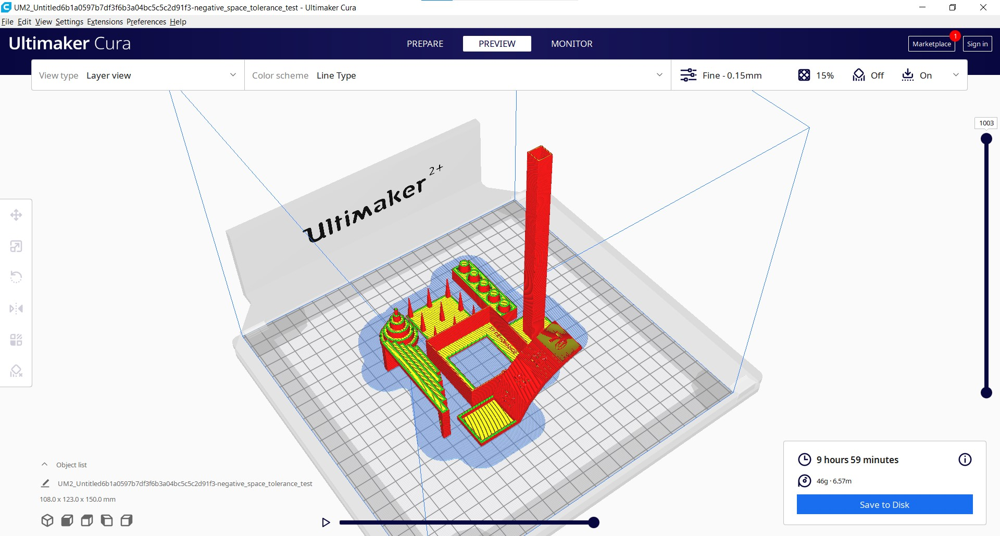{.center style="width:950px"}

&nbsp;

I exported a `.gcode` file to a SD Card and pluged in it into the printer. 

&nbsp;

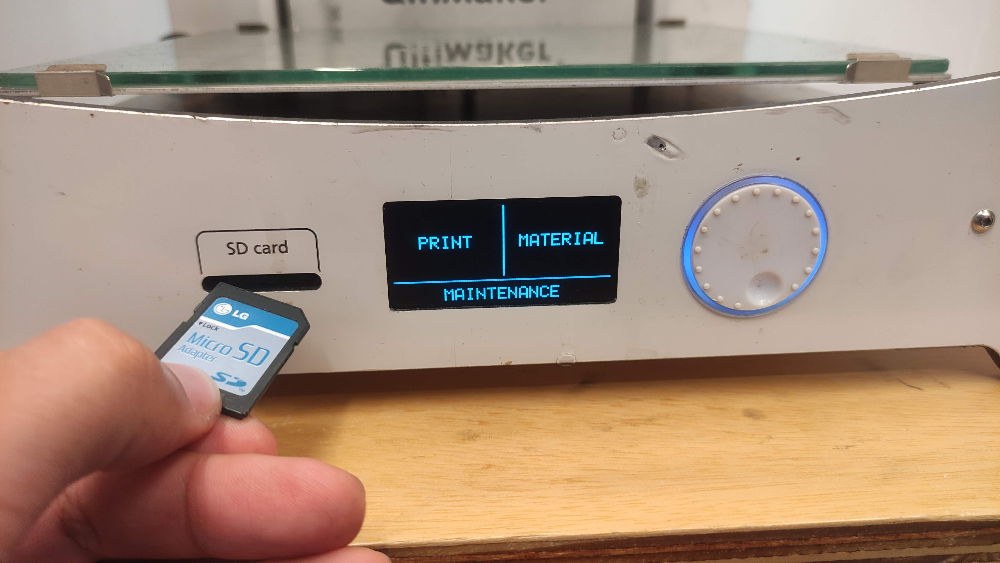{.center style="width:950px"}

&nbsp;

From the main menu I selected the "print" option followed by the selection of the `.gcode` file.

&nbsp;

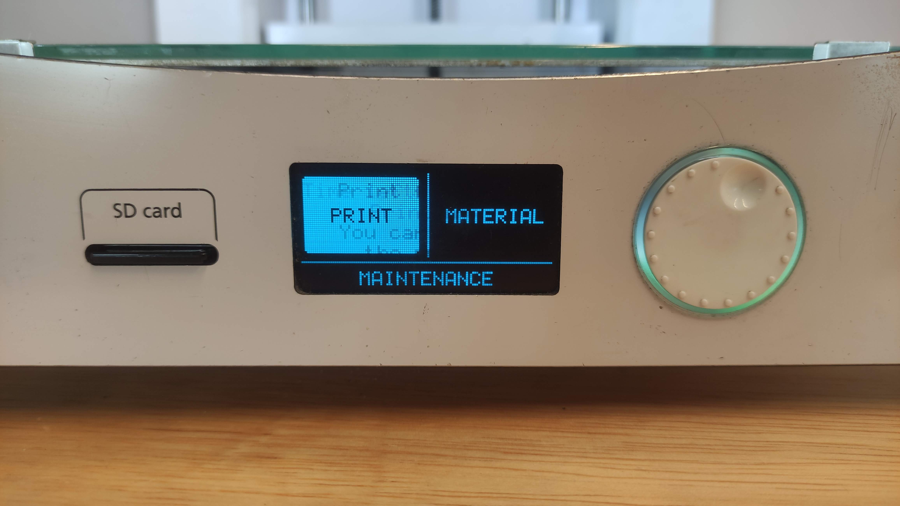{.center style="width:950px"}

&nbsp;

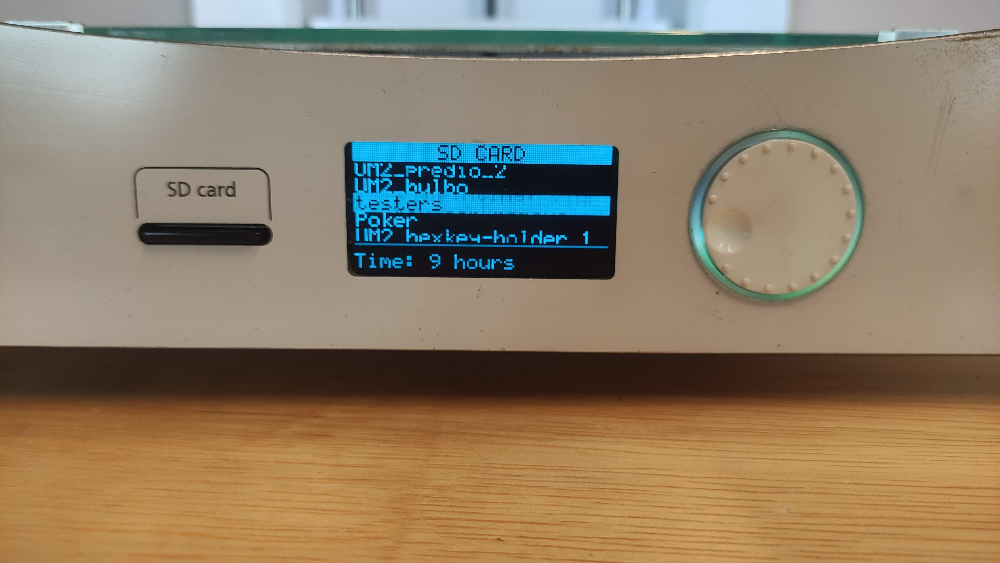{.center style="width:950px"}

&nbsp;

The buildplate and the hotend will start to heat up until **60°C** and **200°C** respectively (temperatures set up for PLA material) and as soon the temperature is reached, the printing process will start.

&nbsp;

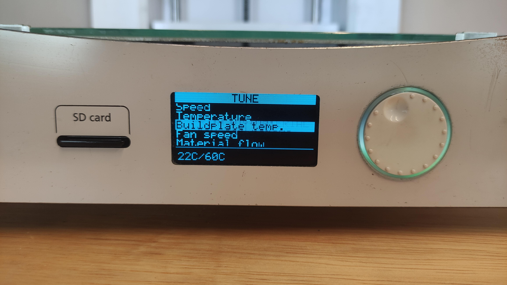{.center style="width:950px"}

&nbsp;

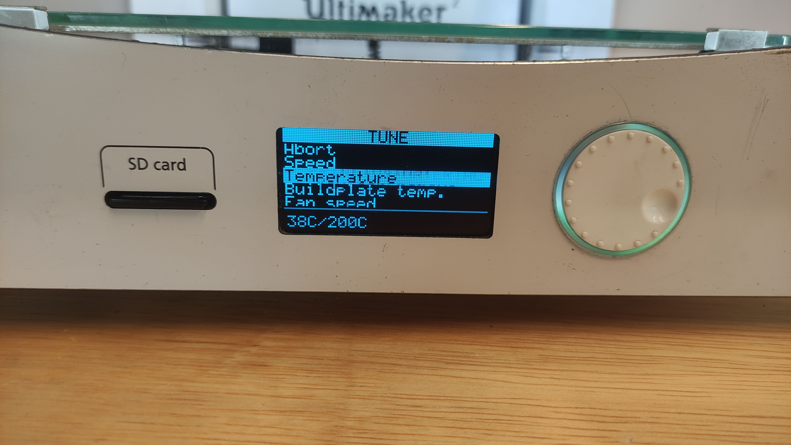{.center style="width:950px"}

&nbsp;

By the end of the process, I got the following result:

&nbsp;

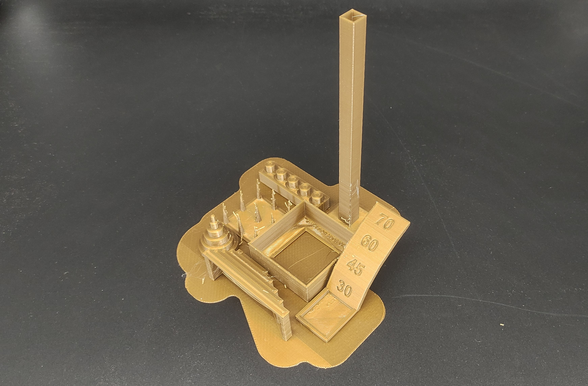{.center style="width:950px"}

&nbsp;

Unfortunately, I notice that some shapes from this print did not came up as I expected. On the the ***dimension accuracy model*** and ***the negative space tolerance model*** the cylinders did not came out rounded but with an elliptical shape. This happened cause the axis and belts from the printer were not aligned and tied enough. Then I needed to adjust them and repeat the printing process. After disassembling, cleaning, aligning and assembling the printer again, I printed the testers one more time and got a better result.

&nbsp;

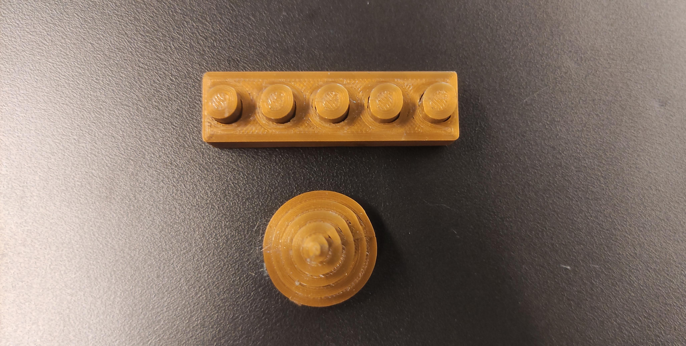{.center}

&nbsp;

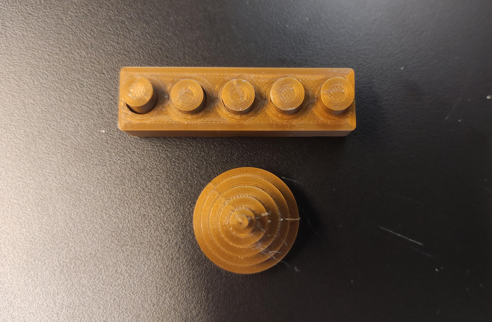{.center}

&nbsp;

With that issue fixed, I could evaluate the testers that were printed.

&nbsp;

### Dimensional Accuracy

&nbsp;

The ***Dimensional Accuracy test*** came out as expected. After fixing the alignment issue that resulted in a elliptical body, the second printed tester came out rounded as planned and with the dimensions according to the digital model.

Here it is the dimensions of the digital model:

&nbsp;

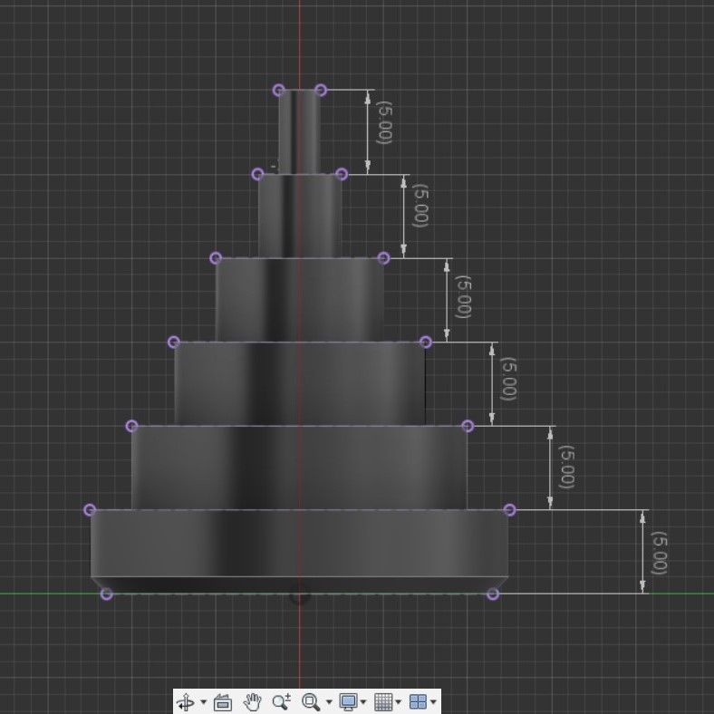{.center} 

&nbsp; 

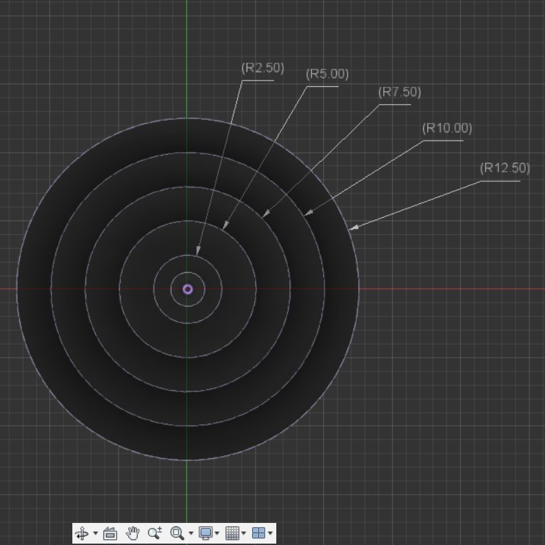{.center}

&nbsp;

Here it is the dimensions of the printed part:

&nbsp;

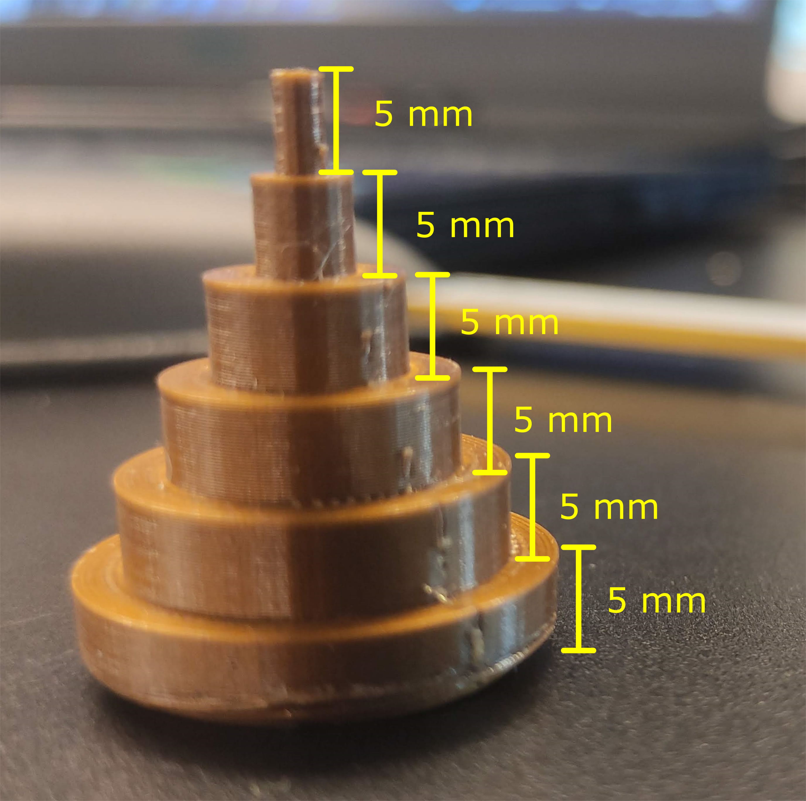{.center} 

&nbsp; 

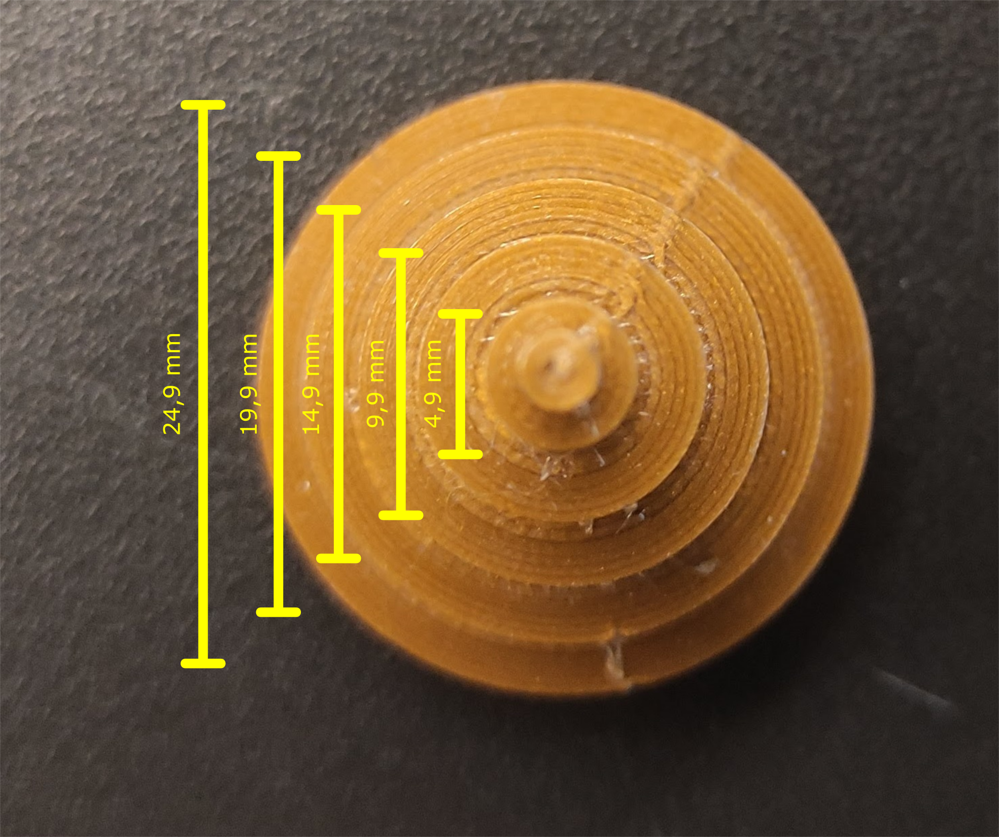{.center}

&nbsp;

### Bridging Performance

&nbsp;

The ***Bridging Test*** also presented good results. The bridges were formed in all levels, but got a better finishing with the first and second one. I would recommend brigdings considering those distances.

&nbsp;

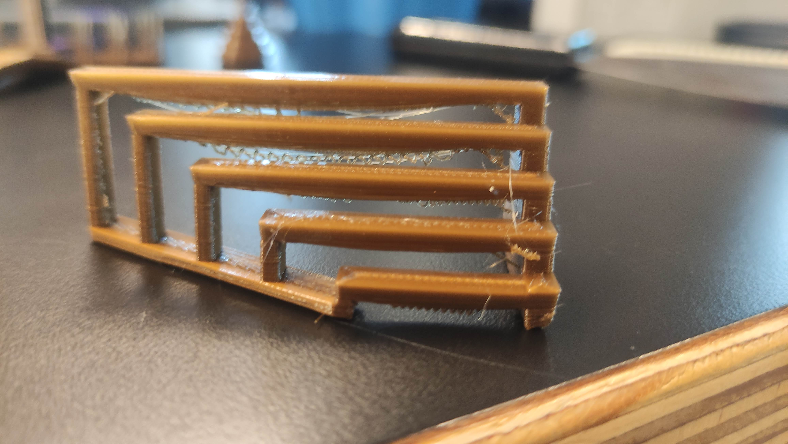{.center}
