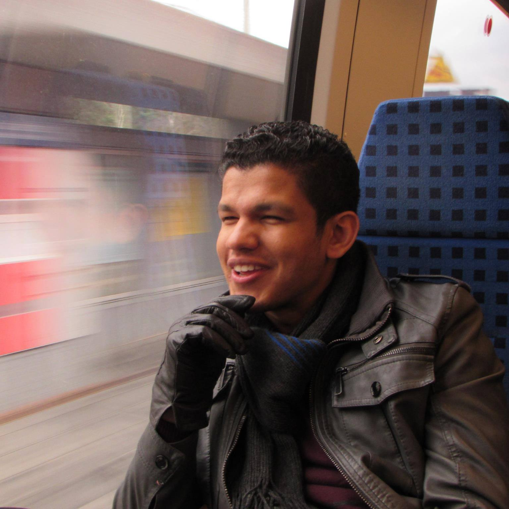
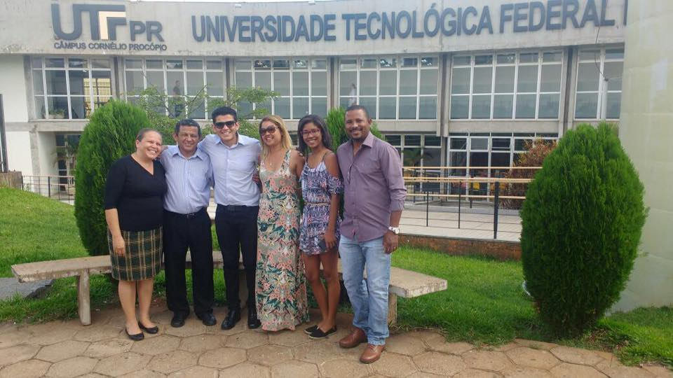
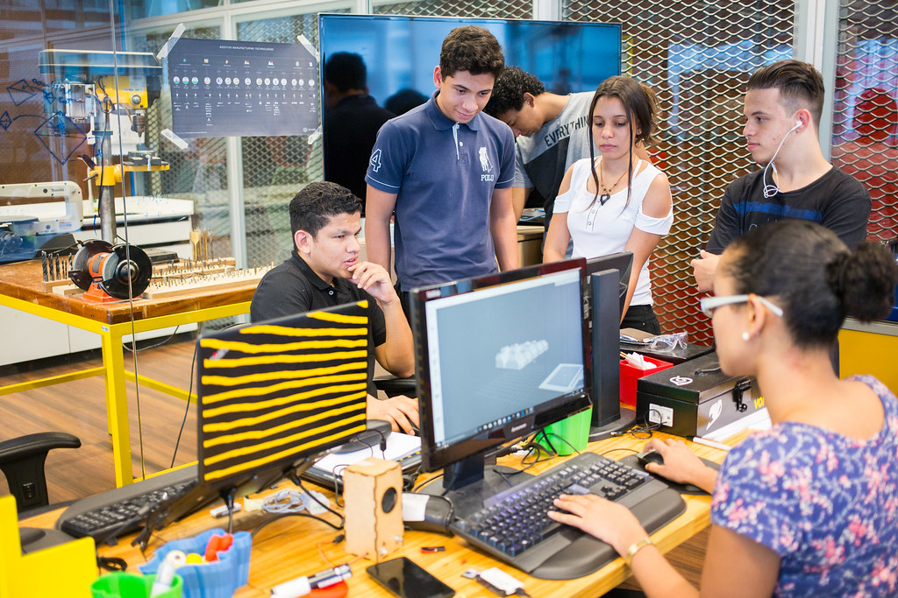

# About me

{:.center style="height:45vh"}

Hello, I am ***Henrique Miranda*** and I'm an that has been working at Insper Fablab since mid 2015. I was born and raised in São Paulo/Brazil 

## Background

{:.center}

 I started studying Electrical Engineering in UTFPR and mid 2014 I did a 7 months internship at Siemens in Erlangen, South Germany, manly working with P&D.
 After graduating in 2016 I worked as an intern at Brasken manly focused in Maintenance and Quality assurance.

## Insper FabLab

Since August of 2017 I've joined the technical team of Fab Lab Insper as a lab technician.

{:.center}
